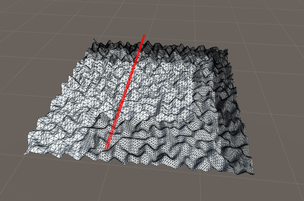

# 11/18/2021

**Note**: there is an issue with SpherePointers and TerrainColliders. Can only use Far Hand Pointer to "touch" terrain, not SpherePointer on finger. Switching from terrain system to custom mesh system with a convex mesh collider.

# 11/15/2021

#### Audio Mixing 
Combining multiple signals (`value += terrains[j].GetValue(i);`) before sending as output waveform data.

``` csharp
private void OnAudioFilterRead(float[] data, int channels) {
        for (var i = 0; i < terrains.Length; i++) {
            if (terrainEnabled[i]) terrains[i].Traverse();
        }
        var samples = data.Length / channels;
        for (var i = 0; i < samples; i += STEP) {
            float value = 0f;
            // Get signals
            for (var j = 0; j < terrains.Length; j++) {
                if (terrainEnabled[j]) value += terrains[j].GetValue(i);
            }
            value *= MASTER_VOLUME;
            for (var ch = 0; ch < channels; ++ch) {
                data[i * channels + ch] = value;
            }
        }
    }
```


#### Noise
Added simplex, fractal, voronoi, perlin, worley and value noise.


https://catlikecoding.com/unity/tutorials/noise/
https://github.com/Scrawk/Procedural-Noise
https://gametorrahod.com/various-noise-functions/

#### Trajectory and Runtime Mesh Manipulation
```csharp
// OnAudioFilterRead is called every time a chunk of audio is sent to the filter (this happens frequently, every ~20ms depending on the sample rate and platform). The audio data is an array of floats ranging from [-1.0f;1.0f] 
private void OnAudioFilterRead(float[] data, int channels) {
        var samples = data.Length / channels;
        yOffset = count++ % width;
        Debug.DrawLine(new Vector3(yOffset, 30, 0), new Vector3(yOffset, 30, width), Color.red, 0.1f);

        for (var i = 0; i < samples; ++i) {
            var value = ((Heights[i % width, yOffset] + 1)/2) * Volume;
            for (var ch = 0; ch < channels; ++ch) {
                data[i * channels + ch] = value;
            }
        }
    }
```
**The red line is the trajectory. It can move in either the x or z axis to take a slice.**



# 11/14/2021

#### Embodiment

[Livecoding the SynthKit: Little Bits as an Embodied Programming Language](https://www.researchgate.net/publication/282722571_Livecoding_the_SynthKit_Little_Bits_as_an_Embodied_Programming_Language)

[Alex McLean - What is embodied programming?](https://slab.org/what-is-embodied-programming/)

[Baalman, Marije - Embodiment of code](https://zenodo.org/record/18748#.YZY3H1NKh25)

#### Wave Terrain Synth

[Developing a flexible and expressive realtime polyphonic wave terrain synthesis instrument based on a visual and multidimensional methodology](https://ro.ecu.edu.au/cgi/viewcontent.cgi?article=1107&context=theses)

[Gestural Sounds by Means of Wave Terrain Synthesis](http://www.academic.konfuzo.net/publications/phd/Mills-Souza-1999-SBC.pdf)

[Possibilities for Dynamical Wave Terrain Synthesis](https://www.stuartgjames.com/uploads/1/7/4/5/17453311/2003jamesacmc.pdf)


[Understanding and Using Csound’s GEN Routines](https://www.eumus.edu.uy/eme/ensenanza/electivas/csound/materiales/book_chapters/02nelson/02nelson.html)

[Wave terrain synthesis with Csound](http://www.csounds.com/jmc/Articles/Wts/WTS.html)


https://www.linkedin.com/pulse/building-modular-synthesizer-unity-using-pure-data-heavy-rothmann/

http://sites.music.columbia.edu/brad/uRTcmix/uRTcmix-tutorial.html

https://github.com/tmhglnd/wave-terrain-synthesis


#### HoloLens Spectator View
Spectator View is an augmented reality product that enables viewing HoloLens experiences from secondary devices. Spectator View has multiple configurations and supports a variety of scenarios from filming quick prototypes to producing keynote demos.

- https://github.com/microsoft/MixedReality-SpectatorView
- https://microsoft.github.io/MixedReality-SpectatorView/README.html
- https://github.com/microsoft/MixedReality-SpectatorView/tree/master/samples
- https://docs.microsoft.com/en-us/windows/mixed-reality/design/spectator-view


# 11/10/2021

- [ALIVEmusic - Augmented Live music performance using Immersive Visualisation and Emotion](https://www.researchgate.net/profile/Richard-Kronland-Martinet/publication/338476696_Proceedings_of_the_14th_International_Symposium_on_Computer_Music_Multidisciplinary_Research/links/5f4397ed299bf13404ebf6ba/Proceedings-of-the-14th-International-Symposium-on-Computer-Music-Multidisciplinary-Research.pdf#page=216)
  - Performance: https://www.youtube.com/watch?v=yEShkolBj-s&ab_channel=matdiffusion


- [Expressive Control of Indirect Augmented Reality During Live Music Performances](https://www.researchgate.net/publication/236594734_Expressive_Control_of_Indirect_Augmented_Reality_During_Live_Music_Performances)
  - Performance: https://www.youtube.com/watch?v=nyVs_5TfN4c&ab_channel=BeatSigner


[Touching Light: A Framework for the Facilitation of Music-Making in Mixed Reality](https://researchrepository.wvu.edu/cgi/viewcontent.cgi?article=9078&context=etd)


##### Glitch Lich Band/Wave Terrian Sythensis

- http://www.curtismckinney.com/WP-Content/resources/papers/Visualizing2013.pdf
- http://curtismckinney.com/WP-Content/resources/papers/OSCthulhuICMC2012.pdf
- https://www.academia.edu/download/37693991/SLEO_2012_Proceedings.pdf#page=122
- Collaboration and Embodiment in Networked Music Interfaces for Live Performance
  - https://core.ac.uk/download/pdf/60240897.pdf
- Lich.js can be used by going to chadmckinneyaudio.com/lich. Binaries for Yig, the Father of Serpents and Shoggoth have been made available at chadmckinneyaudio.com/YigAndShoggoth.zip
- Shoggoth - An Interactive 3D Network Music Space
  - http://www.chadmckinneyaudio.com/WP-Content/resources/papers/ShoggothNIME2013.pdf
- http://eprints.bournemouth.ac.uk/22513/

# 11/5/2021

More related/background papers!

[A Vintage Virtual Reality Interview](http://www.jaronlanier.com/vrint.html)
Super neat interview with "the founder" of VR - Jaron Lanier

[Mobile Augmented Reality](https://www.elsevier.com/__data/assets/pdf_file/0009/96966/Mobile_Augmented_Reality.pdf)
This book section gives a great overview of Mobile device-based AR

[Augmented Reality: A class of displays on the reality-virtuality continuum](https://www.researchgate.net/profile/Paul-Milgram/publication/228537162_Augmented_reality_A_class_of_displays_on_the_reality-virtuality_continuum/links/0c96052ade63de29c0000000/Augmented-reality-A-class-of-displays-on-the-reality-virtuality-continuum.pdf)
This is a landmark paper that describes the Reality-Virtuality (RV) Continuum - an awesome framework for looking at AR/AV/VR/MR etc

[Revisiting Milgram and Kishino's Reality-Virtuality Continuum](https://www.frontiersin.org/articles/10.3389/frvir.2021.647997/full)
Related to above


[Snapping and chatting away: Consumer motivations for and outcomes of interacting with Snapchat AR ad lens](https://www.sciencedirect.com/science/article/pii/S0736585320301738?casa_token=3JIyLQhQMfoAAAAA:7n88uR83NF_bw1YEvm-1ydCEko0SeKN-PPmOLQ-_IWm6CyXDmlB-9y6KsA67zejRYpks_NZ_)
An interesting paper on the commercial usage of AR

[Disney's Aladdin: First Steps Toward Storytelling in Virtual Reality](https://dl.acm.org/doi/pdf/10.1145/237170.237257?casa_token=lEbIh_mHRlMAAAAA:f3Y7JxhcMF0S7JmS8xGfS_JbRxjeSx99oqMqJZ9b1NtiUgAZR3rjcXzjM67el264qbzTnd8L3FZA)
Really new early-applications of AR for performance

[Defining VR](http://papers.cumincad.org/data/works/att/27eb.content.pdf)
Old paper - looks towards a definition of VR that is device-agnostic

[A Classification Scheme for Multi-Sensory Augmented Reality](https://dl.acm.org/doi/pdf/10.1145/1315184.1315216?casa_token=G-LpWeXBTwMAAAAA:peLEK0K5x--YsE6Z4YjD7aAhjVSmwBuPQkbjW6vBl7OQym3YXRklIwqXDeoYWJ3ZAPXjicI_z9JP)
Looking at other senses (besides visual)

[Comparison of optical and video see-through, head-mounted displays](https://www.researchgate.net/publication/228796737_Comparison_of_optical_and_video_see-through_head-mounted_displays)
Comparing different AR HMDS

[Exploring enhancements for remote mixed reality collaboration](https://www.researchgate.net/publication/321405854_Exploring_enhancements_for_remote_mixed_reality_collaboration/figures?lo=1)

[The CAVE: audio visual experience automatic virtual environment](https://link.gale.com/apps/doc/A12353475/AONE?u=mlin_c_worpoly&sid=googleScholar&xid=b62a5199)
Exploration of VR alternatives

[The ultimate VR, AR, MR guide](https://www.aniwaa.com/guide/vr-ar/ultimate-vr-ar-mr-guide/)


[What is Mixed Reality?](https://docs.microsoft.com/en-us/windows/mixed-reality/discover/mixed-reality)
Microsoft's definition of MR - some people not happy about placement


# 10/30/2021

Making a custom hand palm menu with MRTK
- https://localjoost.github.io/migrating-to-mrkt2-making-hand-palm-menu/
- https://github.com/LocalJoost/HandPalmMenu

# 10/20/2021

- Custom grid mesh, get nearest vertex on click & drag

```csharp
    void OnMouseDown() {
        screenPoint = Camera.main.WorldToScreenPoint(gameObject.transform.position);
        offset = gameObject.transform.position - Camera.main.ScreenToWorldPoint(new Vector3(Input.mousePosition.x, Input.mousePosition.y, screenPoint.z));

        Vector3 curPosition = Camera.main.ScreenToWorldPoint(new Vector3(Input.mousePosition.x, Input.mousePosition.y, screenPoint.z));

        float minDistanceSqr = Mathf.Infinity;
        for (int i = 0; i < vertices.Length; i++) {
            Vector3 diff = curPosition - vertices[i];
            float distSqr = diff.sqrMagnitude;
            if (distSqr < minDistanceSqr) {
                minDistanceSqr = distSqr;
                nearestVertexIndex = i;
            }
        }
    }

    void OnMouseDrag() {
        Vector3 curScreenPoint = new Vector3(Input.mousePosition.x, Input.mousePosition.y, screenPoint.z);
        Vector3 curPosition = Camera.main.ScreenToWorldPoint(curScreenPoint) + offset;

        vertices[nearestVertexIndex] = curPosition;
        mesh.vertices = vertices;
        mesh.RecalculateNormals();
    }
  ```

# 10/13/2021

Some master's thesis exploring the HoloLens
- http://bth.diva-portal.org/smash/get/diva2:1305851/FULLTEXT02.pdf
- https://arxiv.org/pdf/1706.08096.pdf
- https://dspace.mit.edu/bitstream/handle/1721.1/119596/1076270652-MIT.pdf?sequence=1&isAllowed=y

Some other projects
- Fenek: A VR livecoding system https://github.com/m-schuetz/Fenek
- CodeChisel 3D: Live programming with three.js and webVR https://robert.kra.hn/past-projects/live-programming-with-three-and-webvr.html


## 10/4/2021

#### Procedural Terrain & Sound in Unity
- Perlin noise, random noise, simplex noise
- Using `Terrain` and `TerrainData.GetHeights()`. The height samples are represented as float values ranging from 0 to 1. The array has the dimensions [height,width] and is indexed as [y,x].

- A slice is taken on the y-axis. Heights are re-normalized [-1, 1] and used to create a waveform.
- Clip Plane shader [tutorial](https://www.ronja-tutorials.com/post/021-plane-clipping/)

#### AR "Performances"
- [Real-time AR performance. Prolight + Sound exhibition](https://www.youtube.com/watch?v=tc9eWK9A2Jw&ab_channel=dreamlaser)
- [Nautilus: Dance Performance with Interactive Augmented Reality](https://www.youtube.com/watch?v=jddd8tgPdwI&ab_channel=AndreasFischer)
  - Voxel projections of dancers
- [ViFlow - Interactive Augmented Reality for Dance](https://www.youtube.com/watch?v=-lHECVWNWSE&ab_channel=JimBach)
  - Interactable projections
- [0AR Trailer | Dance Performance in AR (Augmented Reality) for Public Spaces](https://www.youtube.com/watch?v=eXGaYACpgqQ&ab_channel=A%CE%A6E)
  - AR through the lens of a mobile device
- [Dancing with holograms: CWRU stages dance performance using Microsoft HoloLens](https://www.youtube.com/watch?v=arqO9vgS000&ab_channel=CaseWesternReserveUniversity)
  - Audience equipped with HoloLens
  - Holographic set design, particle effects
- [HoloLens art installation in Times Square](https://www.youtube.com/watch?v=qoyvVFv2R3c&ab_channel=CNET)
  - virtual 3D objects projected onto outdoor spaces
- [Augmented Reality Concert at Home - Hoverlay](https://www.youtube.com/watch?v=Te28s4IZ4p4&ab_channel=Hoverlay)
  - Using AR to transport performers to different places. Viewed through camera lens.
- [augmented reality artist performance on stage](https://www.youtube.com/watch?v=DRpHIRcb_e8&ab_channel=OctosenseAR)
  - Literally a 3D model of Rihanna singing and dancing, viewed through camera lens.
- [Code Augmented Reality Live (CARL)](https://clinicopensourcearts.org/index.php/portfolio/code-augmented-reality-live-carl)
  - An open-source mobile augmented reality experience
  - A programmer/performer codes a 3D environment on the fly using a raymarching algorithm in GLSL. Participants view render on their phones.
  - https://github.com/catilac/CARL
  - I tried out the sample and it just overlays the camera view with a shader graphic. There is no "real" spatial awareness as the view moves with you, although you can turn around from the pivot point. Still super cool stuff!


## 9/27/2021
- Found [Holographic Remoting](https://docs.microsoft.com/en-us/windows/mixed-reality/develop/unity/unity-play-mode?tabs=openxr) for Unity - super useful for quickly testing changes in the HoloLens!
- Followed [how to add near interactivity](https://docs.microsoft.com/en-us/windows/mixed-reality/mrtk-unity/features/input/how-to-add-near-interactivity?view=mrtkunity-2021-05) to add custom input (touch) handling for [mesh deformation](https://catlikecoding.com/unity/tutorials/mesh-deformation/). This work is a starting point for terrain interaction/wave synthesis.
- Added mesh volume calculation as a volume/pitch modifier to an looping AudioClip (one sphere for volume, one for pitch). Would be cool to use the waveform as a live texture somewhere.


#### Procedural Audio Generation in Unity
- Unity script for programmatic `AudioClip` generation from [API doc](https://docs.unity3d.com/ScriptReference/AudioClip.Create.html).
```csharp
using UnityEngine;
using System.Collections;

public class ExampleClass : MonoBehaviour
{
    public int position = 0;
    public int samplerate = 44100;
    public float frequency = 440;

    void Start()
    {
        AudioClip myClip = AudioClip.Create("MySinusoid", samplerate * 2, 1, samplerate, true, OnAudioRead, OnAudioSetPosition);
        AudioSource aud = GetComponent<AudioSource>();
        aud.clip = myClip;
        aud.Play();
    }

    void OnAudioRead(float[] data)
    {
        int count = 0;
        while (count < data.Length)
        {
            data[count] = Mathf.Sin(2 * Mathf.PI * frequency * position / samplerate);
            position++;
            count++;
        }
    }

    void OnAudioSetPosition(int newPosition)
    {
        position = newPosition;
    }
}
```
- Another example using `OnAudioFilterRead`
```csharp
void OnAudioFilterRead(float[] data, int channels) {
    for (int i = 0; i < data.Length; i++) {
        data[i] = Mathf.Sin(2 * Mathf.PI * frequency * i / samplerate);
    }
}
```


## 9/25/2021
- https://www.konsfik.com/procedural-audio-made-in-unity3d/
- https://www.linkedin.com/pulse/building-modular-synthesizer-unity-using-pure-data-heavy-rothmann/
- In Unity, edit audio clips using `AudioClip.SetData` and `AudioClip.GetData`
- https://www.youtube.com/watch?v=O33YV4ooHSo
- http://sonology.org/wp-content/uploads/2019/10/Ioannis-Tsirikoglou.pdf
- https://phaidra.kug.ac.at/open/o:60753

#### WebXR
- Looked into WebXR technology for the HoloLens. Found this [website](https://hololens.glitch.me/). Looks like Firefox Reality for HoloLens 2 is no longer supported or maintained, so best option is Beta Edge Browser.
- Was unable to install [Edge Beta](https://docs.microsoft.com/en-us/hololens/hololens-new-edge) through the Hololens, so tried using the Device Portal from this [article](https://docs.microsoft.com/en-us/windows/mixed-reality/develop/platform-capabilities-and-apis/using-the-windows-device-portal#installing-an-app). It installed successfully but wouldn't run. After some debugging, I realized my HoloLens wasn't up to date.
- Played around with some WebXR samples. Most were for VR, which the HoloLens also supports.
- [This](https://www.servoexperiments.com/webxr-particles/) was a super cool example using AR and interaction (made w/ Three.js). 

#### Research Mode
- Looked into [Research mode](https://docs.microsoft.com/en-us/windows/mixed-reality/develop/platform-capabilities-and-apis/research-mode) and [samples](https://github.com/microsoft/HoloLens2ForCV).
- Had some difficulties getting the samples to run at first, but then figured out that I hadn't applied Research Mode changes.
- The [SensorVisualization](https://github.com/microsoft/HoloLens2ForCV/tree/main/Samples/SensorVisualization) sample was super cool. It's a Holographic UWP application - built starting from a [DX11 template app](https://docs.microsoft.com/en-us/windows/mixed-reality/develop/native/creating-a-holographic-directx-project) in C++.


#### Waveform Terrain Synthesis
A method for generating complex, evolving waveforms using a representation of a three-dimensional surface. The surface may be artificially constructed, or taken from actual geospatial data. To generate the wave, an imaginary traveller traverses an orbit, or closed path of some sort, about the terrain; a simple example is a circle about the surface's center or origin point. The traveller moves from point to point about the path, and at each point it moves to, the value of the output waveform is the elevation of the terrain at that point. One complete traversal of the path constitutes one cycle of the output waveform. Evolving waveforms are created by varying the path; for example, in the case of a circular path, the radius can be varied [(Electronic Music, Website)](https://electronicmusic.fandom.com/wiki/Wave_terrain_synthesis)

#### Wavetable Synthesis
Wavetable synthesis is a sound synthesis technique used to create periodic waveforms.[(Wavetable Synthesis, Wikipedia)](https://en.wikipedia.org/wiki/Wavetable_synthesis)

#### Object Recognition
- https://azure.microsoft.com/en-us/services/cognitive-services/custom-vision-service/
- https://ieeexplore.ieee.org/document/9057151
- https://core.ac.uk/download/pdf/326909176.pdf
- Lab Assist Vision, Object Recognition/Tracking for the HoloLens 2 (https://github.com/cookieofcode/LabAssistVision)
- VisionLib Object Tracking
- https://localjoost.github.io/labeling-toy-aircraft-in-3d-space-using/


## 9/21/2021
- Created a custom [pulse shader](https://docs.microsoft.com/en-us/windows/mixed-reality/mrtk-unity/features/rendering/pulse-shader?view=mrtkunity-2021-05) for spatial mapping
- Created, built, and deployed a basic Unity w/ MRTK app. Added an `NearInteractionGrabbable`, `Object Manipulator` and `Contstraint Manager` component to a basic cube.


- Investigated the Device Portal (accessed through the HoloLens IP address in a browser). There's a cool 3D View feature that shows the current spatial mapping model. It can be even exported as an `.obj` file.

